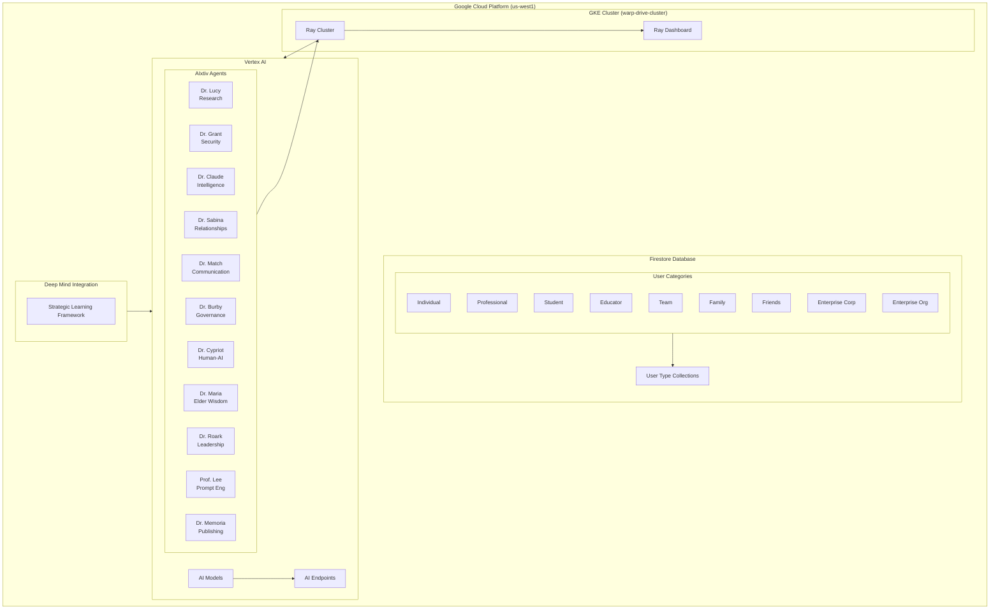

# System Architecture

The AIxtiv platform's architecture is built on Google Cloud Platform (GCP) in the us-west1 region, integrating various AI and cloud services to provide a robust, scalable system. The architecture combines GKE clusters, Vertex AI capabilities, specialized AI agents, and data management systems to deliver an comprehensive AI-powered solution.

## Architecture Diagram

## Component Details

### GKE Cluster with Ray
The Google Kubernetes Engine (GKE) cluster, named "warp-drive-cluster," hosts a Ray distributed computing framework. This setup enables:
- Distributed processing and computation across the cluster
- Real-time monitoring through the Ray Dashboard
- Efficient resource allocation and scaling for AI workloads

### Vertex AI Integration
Vertex AI serves as the core AI platform, providing:
- Managed AI model deployment and hosting
- Scalable AI endpoints for model serving
- Integration with custom AI models and endpoints
- Support for both training and inference workflows

### AIxtiv Agents
A specialized team of AI agents, each with unique expertise:
- Dr. Lucy: Research and analysis
- Dr. Grant: Security protocols and risk assessment
- Dr. Claude: Intelligence and reasoning
- Dr. Sabina: Relationship management
- Dr. Match: Communication optimization
- Dr. Burby: Governance and compliance
- Dr. Cypriot: Human-AI interaction
- Dr. Maria: Elder care and wisdom
- Dr. Roark: Leadership and strategy
- Prof. Lee: Prompt engineering
- Dr. Memoria: Content publishing and management

### Firestore Database Structure
The database is organized around user types and collections:
- Individual users
- Professional accounts
- Student accounts
- Educator profiles
- Team collaborations
- Family groups
- Friend networks
- Enterprise corporate accounts
- Non-profit organization accounts

### DeepMind Integration
The DeepMind integration incorporates:
- Strategic Learning Framework (SLF) for advanced AI capabilities
- Direct integration with Vertex AI for enhanced model performance
- Advanced learning and adaptation capabilities

